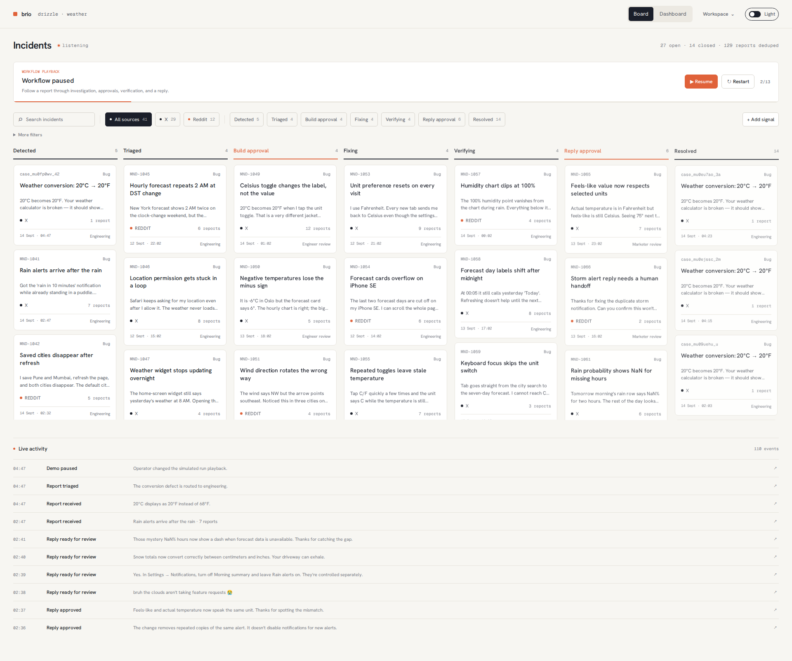

# brio

**[Watch the demo](https://drive.google.com/file/d/1r_ZpACtP0KhSlO39drxLUy0nQIcyJCd1/view?usp=sharing)** · **[Open brio](https://mend-hackathon.vercel.app/cases)**

**Workspace access code:** `ab37ee43c3d2cd841d56609bd2f743934b4d0a7c34a50a4f72259a78ffed8d73`

**From customer complaint to product fix, with a personality.**

brio connects customer conversations to engineering work. It brings reports, investigation, approvals, fixes, and replies into one workflow, with humans making the key decisions in Slack and a live Kanban board showing every step.

## One complaint, one continuous story

A customer reports that Drizzle's temperature toggle turns **20°C into 20°F**. The correct result is **68°F**. brio's resolution workflow connects that complaint to the work needed to address it:

1. **Understand the report.** Preserve the original conversation, identify related reports, and classify the issue.
2. **Investigate.** Reproduce the problem, collect evidence, and prepare a scoped build plan.
3. **Ask the engineer.** Ellen reviews the plan in Slack and chooses **Build** or **No Build**.
4. **Prepare the fix.** Engineering work produces a candidate change with protected checks and a preview.
5. **Ask the marketer.** David reviews the candidate and the exact customer response, then chooses **Go** or **No-go**.
6. **Verify and close the loop.** Release the approved change, check its live behavior, and reply to the original customer. The reply receipt stays attached to the case.

The board follows the same incident through **Detected → Triaged → Build approval → Fixing → Verifying → Reply approval → Resolved**. Evidence, decisions, and activity remain available in its timeline.

## A brand voice, built in

Some interactions call for a fix. Others call for a little personality.

> **Customer:** “Drizzle, please make it rain. My plants are judging me.”
>
> **Playful persona:** “bruh 💀”

Teams configure tone, warmth, slang, humor, and light roasts, with examples and boundaries for when to engage. An approved persona policy can authorize eligible low-risk replies automatically. Real complaints follow the support or engineering route.

The included personas are **Friendly Internet Brand**, **Clear Support**, and **Playful Challenger**.

## What brio brings together

- **Live visibility:** Kanban transitions and an activity feed update across open tabs.
- **Human decisions:** engineer Build and marketer Go approvals happen in Slack.
- **Connected context:** customer reports, Linear tickets, GitHub changes, checks, and replies belong to the same case.
- **Controlled publication:** exact reply approvals, confirmed receipts, and a tracked manual fallback.
- **Repeatable demos:** persistent sample incidents with Run workflow, Pause, Resume, and Restart controls.

The hosted demo uses seeded data and simulated approvals, repairs, and replies. A complete live customer-to-repair run remains to be verified.

## Built with

| Layer | Technology |
| --- | --- |
| Web application | Next.js, React, TypeScript |
| Data and orchestration | Convex, Convex Workflow, Convex Agent |
| AI | OpenAI |
| Team workflow | Slack, Linear, GitHub |
| Hosting and workers | Vercel, Google Cloud Run |
| Browser automation and verification | Playwright, Chromium |
| Runtime and package management | Bun |

Drizzle lives in a [separate weather repository](https://github.com/Aarush-Dubey/hackathon-weather), providing a concrete product and a reproducible bug for the demonstration.
