# PRD — FDE for B2C Apps

**One-liner:** Turn every customer complaint into a verified resolution.
**Positioning:** Other support products answer customers. We change the product because of them.
**Status:** Hackathon MVP · Owner: Aarush Dubey · Last updated: 2026-09-13

## 1. Problem
B2C companies get thousands of signals a day on X, Reddit, and elsewhere. The path from "customer says it's broken" to "fixed, and the customer knows" is manual and lossy: support reads it → Slack message → ticket → engineering tries to reproduce → fix ships → nobody tells the original customer. Duplicates become separate tickets; solved problems get re-investigated.

## 2. Product thesis
An always-on **Forward Deployed Engineer** between a consumer app's users and its engineering org. Not a support chatbot: an autonomous **customer-to-engineering system** with humans approving the decisions that carry risk.

`Signal → Evidence → Memory → Reproduction → Human QA → Build decision → Fix → Verification → Launch decision → Deploy → Customer resolution → Learning`

## 3. Goals / Non-goals
**Goals (MVP)**
- One fully end-to-end, *real* closed loop on a demo app: complaint → reproduced → PR → verified → deployed → customer reply.
- Cluster duplicate complaints into one incident.
- Instant answers for known, already-solved issues.
- Humans approve at three gates via Slack buttons. Nothing public or production-bound happens without a human click.
- A dashboard built around the incident lifecycle and evidence, not a chat UI.

**Non-goals (MVP)**
- LinkedIn, Discord, app-store reviews, PostHog/analytics. These are post-MVP (principle: *every integration must be a distinct stage of the loop*).
- Operating on real customer production repos.
- Fully autonomous merges/replies without approval.
- Multi-tenant onboarding, billing, SSO.

## 4. Users & roles
| Role | Where they act | Decides |
|---|---|---|
| **End customer** | X / Reddit | Reports the problem; receives the resolution reply |
| **QA reviewer** | Slack | Is this a validated, real bug? (Validated / Needs info / Not a bug) |
| **Product engineer** | Slack | Build / No build; reviews the PR |
| **Marketer / comms** | Slack | Go / No-go on shipping the change *and* publishing the customer reply; can edit the reply |
| **Admin** | Dashboard | Connects apps, maps Slack user IDs to roles, configures brand voice |

For the demo, one person can hold all roles. Buttons are still enforced per mapped Slack user ID.

## 5. Connected apps
| App | Role in loop | Integration | Real vs. fixture |
|---|---|---|---|
| **X** | Voice of customer (in + reply out) | Official X API v2, pay-per-use (see §5.1) | Real if credits bought; labelled fixtures otherwise |
| **Reddit** | Voice of customer (in + reply out) | Official Reddit Data API (OAuth), scoped to a demo subreddit | **Requires approval** (see §5.2); labelled fixtures until granted |
| **Slack** | Org coordination + all human gates | Slack app: `chat.postMessage` (thread per incident, store parent `ts`), Block Kit buttons, interactivity endpoint | Real |
| **Linear** | Canonical engineering ticket | `@linear/sdk`, API key for demo workspace | Real |
| **GitHub** | Code, CI, PR, deploy trigger | Repo-scoped fine-grained token; `workflow_dispatch` to Actions; PR + checks via REST | Real |

Linear, Slack, and GitHub alone meet the ≥3 real-app requirement, so the demo never depends on social API approval.
There are no GitHub Issues: Linear is the single ticket of record, and the PR links to it.

### 5.1 X integration decision
- **Facts (checked Sep 2026):** X's free tier was closed to new developers in Feb 2026. New apps use **pay-per-use**: about **$0.005 per post read** and **$0.015 per post created** (more if the post contains a link), with no monthly minimum.
- **Hackathon cost:** reading ~1,000 mentions (~$5) plus ~30 replies (~$0.50) comes to **under $10 of credits**. That's cheap enough that the official API is the right choice.
- **Implementation:** a Convex cron (every 60s) calls `GET /2/users/:id/mentions` with `since_id`, storing the cursor in Convex. Keep `expansions` minimal to control reads. Replies go out via `POST /2/tweets` with `reply.in_reply_to_tweet_id`.
- **Policy guardrails:** only reply to posts that @mention the brand account, never keyword-search strangers. Every reply is human-approved (marketer "Go"), so it isn't an autonomous AI reply bot. For the demo, complaints come from our own test accounts, and replies don't include links, which also avoids the higher link price.
- **Rejected:** scraping/cookie-based tools (Agent-Reach, twitterapi.io-style resellers, Apify scrapers). They carry ToS and account-ban risk, can't post reliably, and add a runtime outside Convex.
- **Fallback:** if credits or the account aren't ready, use `source: "fixture"` signals, clearly labelled in the UI. Replies are drafted and shown but not posted.

### 5.2 Reddit reality check
Reddit is **not** self-serve anymore. Since Nov 2025 (Responsible Builder Policy), new OAuth apps need manual approval, and commercial use is negotiated separately. **Action: file the access request on day 0.** Scope it to one demo subreddit, reading posts/comments plus replying in-thread. Until approved, Reddit runs on labelled fixtures behind the same adapter interface.

## 6. System architecture
- **Dashboard:** Next.js 16 (App Router), TypeScript, Tailwind 4 + shadcn/ui, Convex React client (live queries).
- **Backend and orchestration:** Convex, using `@convex-dev/agent` for agents (OpenAI models, tool calls, thread history) and `@convex-dev/workflow` for the durable, retryable incident workflow that pauses at human gates. This **replaces the scaffold's LangGraph** route (`src/app/api/agent/route.ts`, `src/lib/agent.ts`) for the MVP.
- **Slack interactivity:** a Convex HTTP action (`convex/http.ts`) verifies the Slack signing secret and the clicker's role, records an `approvals` row, and resumes the workflow.
- **Code execution:** runs in GitHub Actions, never in Convex. Convex dispatches the workflow, Actions runs the coding agent and tests, then calls back into Convex over HTTP with its results. That job only has access to the demo repo and an allowlist of files, with no production secrets.
- **Demo target app:** a separate repo, "Weather app", deployed on Vercel from `main`. It uses fixed weather data and has one real seeded bug: switching °C→°F changes the label but not the number. The canonical test is that fixture 20 °C renders "68 °F". The test file is on a **protected path**; the coding agent can't modify it (enforced by a CI check that fails the PR if it changes).
- **Organizational memory:** a Convex `solvedIssues` table seeded with about 10 fictional historical issues (symptoms, version, root cause, fix, verification). Matching uses Convex vector search on embeddings. No external vector DB.

## 7. Incident lifecycle (with human-in-the-loop)

```mermaid
stateDiagram-v2
  [*] --> SIGNAL
  SIGNAL --> TRIAGED: Triage Agent
  TRIAGED --> IGNORED: praise/spam/banter (no action or low-risk reply)
  TRIAGED --> KNOWN_FIX: Memory Agent match
  KNOWN_FIX --> AWAITING_LAUNCH: reply-only path
  TRIAGED --> REPRODUCING: likely bug (new or clustered)
  REPRODUCING --> QA_REVIEW: evidence packet
  QA_REVIEW --> NEEDS_INFO: Needs info / not reproduced
  QA_REVIEW --> CLOSED: Not a bug
  QA_REVIEW --> AWAITING_BUILD: Validated (Linear ticket + Slack thread created)
  AWAITING_BUILD --> DECLINED: No build (backlog; optional holding reply)
  AWAITING_BUILD --> BUILDING: Build
  BUILDING --> VERIFYING: PR opened
  VERIFYING --> BUILDING: fail (max 2 retries)
  VERIFYING --> ESCALATED: still failing → PE in Slack
  VERIFYING --> AWAITING_LAUNCH: pass
  AWAITING_LAUNCH --> HELD: No-go (PR stays open, no reply)
  AWAITING_LAUNCH --> DEPLOYING: Go
  DEPLOYING --> POST_DEPLOY_CHECK
  POST_DEPLOY_CHECK --> RESOLVED: pass → publish customer replies, close Linear
  POST_DEPLOY_CHECK --> ESCALATED: fail → reply withheld, Slack alert
  RESOLVED --> [*]
```

**Dashboard's simplified lane:** `SIGNAL → TRIAGED → REPRODUCED → QA ✓ → BUILD ✓ → FIXING → VERIFIED → GO ✓ → RESOLVED`

### Human gates
| Gate | Slack message contents | Buttons | On click |
|---|---|---|---|
| **G1 QA** | Clustered complaints (count, quotes, links), triage (category, severity, component, confidence), reproduction evidence (steps, expected vs actual, logs/screenshot, version), related past incidents | Validated · Needs info · Not a bug | Validated creates the Linear ticket and moves the incident to G2. Needs info drafts a clarifying reply for G3-style approval. |
| **G2 Product engineer** | Everything in G1 plus the Linear link, Engineering Agent's root-cause hypothesis, proposed change scope, and risk level | Build · No build | Build dispatches the GitHub coding job. No build marks it Declined in Linear and offers the marketer an optional acknowledgement reply. |
| **G3 Marketer** | Plain-language summary of the change, PR link, verification results (before fail → after pass, regression suite), affected customers, and the **editable drafted reply** in brand voice per platform | Go · No-go (+ Edit reply modal, comment field) | **Go** merges the PR, Vercel deploys, and the post-deploy check runs. **Replies publish only after that check passes**, and the Slack thread gets the posted links. No-go leaves the change and reply unpublished, and the comment is logged. |

Rules: gates are enforced by role→Slack user ID mapping, each click is idempotent and recorded with the user, timestamp, and comment, and pending gates re-ping the approver after 15 min. The known-fix path skips G1/G2 and goes straight to G3 as a reply-only approval.

## 8. Agents
| Agent | Question it answers | Inputs → Outputs | Tools |
|---|---|---|---|
| **Scout** | What are customers saying? | X mentions, Reddit posts → normalized `signals` | X/Reddit adapters (or fixtures) |
| **Triage** | What is actually happening? | signal → category (bug, support query, known issue, feature request, negative feedback, praise, banter, spam/abuse), severity, sentiment, component, confidence, cluster assignment | LLM structured output, embeddings |
| **Memory** | Have we seen this before? | incident → best `solvedIssues` match + similarity, related Linear tickets | Convex vector search, Linear search |
| **Reproduction** | Can I prove the customer is right? | incident → repro plan, run result, evidence packet | GitHub `workflow_dispatch` (Playwright against current deploy) |
| **Engineering** | What caused it and what fixes it? | validated incident → root cause, branch, PR linked to Linear | Runs inside GitHub Actions on an allowlisted file scope |
| **Verification** | Did that fix the customer's exact problem? | PR → fail-before/pass-after on the canonical test, regression suite, post-deploy check | Separate Actions job; separate prompt/model context from Engineering |
| **Comms** | What do we tell the customer? | incident + outcome + brand config → per-platform reply drafts | Brand/persona config |

## 9. Brand / persona layer
- Admin picks a voice preset (professional-concise, warm, developer-focused, playful, meme-heavy, "chill older brother") plus custom guidance and banned phrases.
- **Humor guardrail:** humor is only allowed when category = banter **and** confidence ≥ 0.9 **and** there are no risk flags (bug, billing, security, data loss, anger, ambiguity). Everything else gets a respectful tone regardless of preset.
- Every reply, including banter, goes through G3 in the MVP.

## 10. Dashboard (UX)
- **Incident board:** columns follow the lifecycle lane. Cards show title, report count, severity, confidence, first seen, component, and which gate is pending, with an owner avatar.
- **Incident detail:** a vertical timeline of agent reasoning and actions, plus clustered original posts, the evidence packet (repro steps, screenshots, logs), Memory matches, the Slack thread link, Linear ticket, PR with checks, before/after test results, deploy status, approval log, and final replies with links.
- **Settings:** connections status, role mapping, brand voice, "fixture mode" toggle per source.
- **Fixture injector (demo):** fires N labelled synthetic complaints so the clustering moment happens on stage.

## 11. Data model (Convex)
`signals` (source, externalId, author, text, url, createdAt, isFixture, triage fields, incidentId) ·
`incidents` (title, state, severity, component, confidence, reportCount, linearId, slackChannel, slackThreadTs, prNumber, workflowId) ·
`solvedIssues` (symptoms, version, rootCause, fix, verificationNotes, embedding) ·
`evidence` (incidentId, kind: repro|test|log|screenshot|deploy, payload, runUrl) ·
`approvals` (incidentId, gate: qa|build|launch, decision, slackUserId, comment, at) ·
`timelineEvents` (incidentId, agent, action, summary, data, at) ·
`replyDrafts` (incidentId, signalId, platform, text, status: draft|approved|posted|withheld, postedUrl) ·
`brandConfig`, `roleMappings`, `sourceCursors` (e.g. X `since_id`).
The scaffold's `conversations`/`messages` tables get removed.

## 12. Safety & trust requirements
- No public post, merge, or deploy without the corresponding human gate.
- Customer replies are published only after the post-deploy check passes.
- The coding agent can't edit protected tests and can't touch files outside the allowlist, and the CI job has no production secrets.
- "Not reproduced" means *needs more info*, never "customer is wrong".
- All credentials stay server-side in Convex env vars. Slack requests are signature-verified.
- Fixture data is always visibly labelled. We don't claim live social access we don't have.

## 13. Hero demo script (~5 min)
1. Three X/Reddit posts (real or labelled fixtures) say °F shows the wrong temperature. The board shows **one** emerging incident with 3 reports, 94% confidence, High severity, component `units`.
2. Memory: "Similar #12 (locale formatting) had a different root cause, so no known fix."
3. Reproduction: "Fixture 20 °C → UI shows '20 °F', expected '68 °F'." Includes a screenshot, and the QA card appears in Slack. **Click Validated.** A Linear ticket is created.
4. The PE card appears with the root-cause hypothesis. **Click Build.** The Action runs and PR #N opens.
5. Verifier: test fails on `main` and passes on the PR, and 12/12 regression tests pass.
6. The marketer card shows the summary and drafted reply. **Edit a word, click Go.** Merge, deploy, and the post-deploy check pass.
7. Replies are posted ("You caught a real bug — fixed and live now. Thanks for flagging it 🙌"), Linear closes, and the Slack thread and dashboard show RESOLVED.
8. Encore: a fourth identical complaint gets an instant known-fix reply draft from memory.

## 14. Success metrics (MVP)
- End-to-end agent time under 10 min, excluding human waits.
- Duplicate-clustering accuracy on the fixture set at least 90%.
- Zero public replies or merges without a recorded approval.
- Known-issue repeat answered in under 30 s.
- Humor guardrail: 0 humorous drafts on the non-banter fixture set.

## 15. Milestones
1. **Foundation:** Convex schema, Slack app + interactivity endpoint, Linear + GitHub adapters, fixture injector, weather app repo with seeded bug + protected test + Vercel deploy.
2. **Brain:** Scout/Triage/Memory agents, clustering, seeded `solvedIssues`, incident board.
3. **Loop:** workflow with the G1/G2/G3 gates, Reproduction + Engineering + Verification Actions, deploy + post-deploy check.
4. **Voice:** Comms agent, brand config, reply publishing to X (pay-per-use) and Reddit (if approved).
5. **Polish:** incident timeline UI, demo rehearsal, failure-path demos (No-go, verification retry).

## 16. Risks & open questions
- **Reddit approval may not arrive in time.** Mitigation: fixtures behind the same adapter, filed day 0.
- **X account/credits.** Mitigation: fund about $10 early and test replies from our own accounts first.
- **LLM-generated fix may be flaky live.** Mitigation: a tightly scoped seeded bug, retries, and a recorded backup run.
- **Open:** should QA (G1) auto-pass when reproduction confidence is ≥ 0.95, or always be human? (MVP default: always human.)
- **Open:** on "Needs info", should the clarifying public reply also require marketer approval? (MVP default: yes.)
- **Interpretation:** "Go publishes the reply" means the customer reply is posted on X/Reddit and the Slack thread is updated with the posted link.
